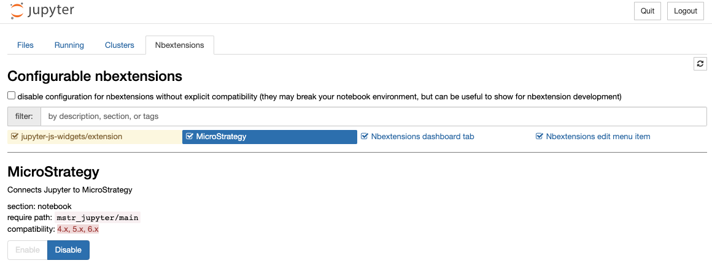

# MicroStrategy for Jupyter

## `nbextensions` Warning Clarification

If you enter "Nbextensions" tab inside __Jupyter Notebook__ and see the following:

Please be aware this is a known issue with `jupyter_contrib_nbextensions`.
__MicroStrategy for Jupyter__ addon works correctly.

It was tested and verified that __MicroStrategy for Jupyter__ is fully compatible with `notebook` ver. 6.x
so the warning above can be ignored.

The checkbox: "_disable configuration for nbextensions without explicit compatibility..._"
should be __OFF__, as in the image above.

_References_:

- <https://github.com/Jupyter-contrib/jupyter_nbextensions_configurator/issues/103>
- <https://stackoverflow.com/a/58146865>
